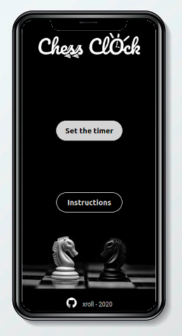

# Javascript-Chess-Clock

A JavaScript chess clock

**Chess Clock** is a JavaScript Chess clock designed for mobile and desktop written in HTML/CSS/JavaScript

Overview
===

The goal of this project is to make a little web app for training purpose.

Objectives
---

- Design and logo creation
- Use only HTML/CSS/JavaScript
- Make it responsive for mobile and desktop

Screenshots
---

Credits for background image
---

Hassan Pasha

https://unsplash.com/photos/7SjEuEF06Zw

